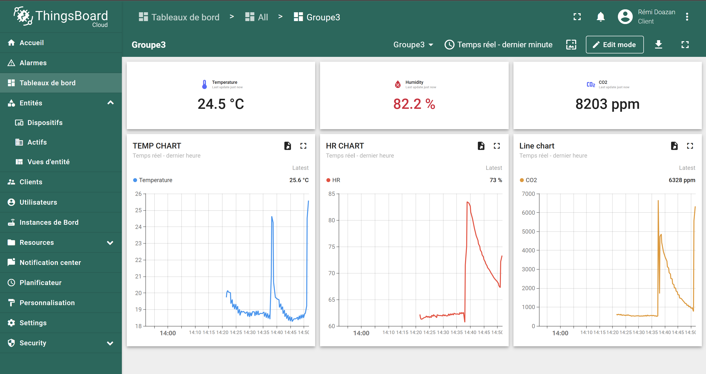

# Setup

Suivre les instructions suivantes pour configurer l'environnement : 

```bash
$ git clone git@github.com:Helios-rmd/ENSEIRB-Capteurs-pour-l-embarque_HR_RD.git
$ cd ENSEIRB-Capteurs-pour-l-embarque_HR_RD
$ mbed deploy
$ mbed new .
$ mbed target ZEST_CORE_FMLR-72
$ mbed toolchain GCC_ARM
```

Pour compiler et flasher : 

```bash
$ mbed compile
$ sixtron_flash
```


# Exercices

## Exercice 1 : LED

Se déplacer au commit suivant et compiler:
```bash
$ git checkout ee7211fdc6143d3162a716d838085d64bfebb778
$ mbed compile
```
La led verte s'allume quand on presse le bouton.

## Exercice 2 : Allumage Led par interruption

Se déplacer au commit suivant et compiler:
```bash
$ git checkout cc0077715c78c56bd167a5305b18043464604cfc
$ mbed compile
```
La led s'allume quand on presse le bouton. Mais cette fois ci en attachant une fonction à l'interrubption générée par un appui bouton

## Exercice 3 : Allumage Led avec Timmer

Se déplacer au commit suivant et compiler:
```bash
$ git checkout 0e273eb97394cf5499576be2143933d2f2c4c05a
$ mbed compile
```
La led s'allume quand on presse le bouton. Mais cette fois ci en attachant une fonction à l'interrubption générée par un appui bouton.

## Exercice 4 :  Contrôle de la LED par un ticker

Se déplacer au commit suivant et compiler:
```bash
$ git checkout 1296f49f59e710f4f4a61def5e64331f8e664bf7
$ mbed compile
```
La led blink seule. Mais cette fois ci avec un ticker.

## Exercice 5 :  Contrôle de la frequence de clignotement avec le bouton

Se déplacer au commit suivant et compiler:
```bash
$ git checkout a7346233ede5d163e1d907eee8d042b392afee6f
$ mbed compile
```

Les appui bouton changent la frequence de clignotement de la led.

# Projet

## Présentation 
L'objectif de ce projet est de récupérer les données d'un capteur pour les transmettre vers une plateforme cloud (Things Borad).
En utilisant la zest core FMLR-72 et une zest sensor équipée d'un capteur de CO2.
### Configuration
Pour le projet il faut se placer sur le dernier commit :
```bash
$ git checkout c153276aca9aaaf94430bc2804cbbbe76b694476
$ mbed compile
```
## Explication des choix
### Gestion du capteur
Notre capteur communique en I2C avec la zest core. Nous avons créé notre propre driver pour ce capteur dans `co2sensor.cpp`. La classe Co2Sensor regroupe toutes les méthodes utiles pour réaliser des musures. Elle simplifie l'utilisation de ce capteur en proposant uniquement quelques APIs qui proposent une abstraction de la gestion spécifique au capteur.

### Dashboard
Ici une capture du dashboard ThingsBoard, après avoir volontairement placé la carte dans un environnement chaud, humide et chargé en CO2 (soufle humain avec la carte enfermée dans les mains)


A continuer

# Archives

Cette partie du Readme contient des notes personelles

The `main()` function is the single thread in the application. It toggles the state of a digital output connected to an LED on the board.

## Activate venv
```bash
$ source ~/my_env01/bin/activate  
```
## Configure

Run the following commands to define target and toolchain:
```bash
(env_name)$ mbed target ZEST_CORE_FMLR-72
(env_name)$ mbed toolchain GCC_ARM
```

## Building and running

1. Connect a USB cable between the USB port on the board and the host computer.
2. Run the following command to build the example project and program the microcontroller flash memory:

```bash
$ mbed compile
```
Your PC may take a few minutes to compile your code.

Then flash uc

```bash
$ sixtron_flash
```

3. Display target communication

```bash 
$ ls /dev/ttyUSB*
$ minicom -D /dev/ttyUSB0 --baud 9600
$ mbed sterm --port /dev/ttyUSB0 --baud 9600
```

# Sensor communication features (CO2 sensor SCD41-D-R2)
1. Features
    
    I2C communication
    
    Adress : 0x62
    
    Data type and length :  Data sent to and received from the sensor consists of a sequence of 16-bit commands and/or 16-bit words (each to be interpreted
                            as unsigned integer with the most significant byte transmitted first). Each data word is immediately succeeded by an 8-bit CRC.
                            In write direction it is mandatory to transmit the checksum. In read direction it is up to the master to decide if it wants to process the checksum
    
See https://sensirion.com/media/documents/48C4B7FB/66E05452/CD_DS_SCD4x_Datasheet_D1.pdf p7 for more details

2. Get a single measure
    
    Use measure_single_shot command : 0x219d 

    Wait for max. command duration time (5000ms)

    Then use read_measurement command : 0xec05

3. Convert signal

    𝐶𝑂2 [ppm] = 𝑤𝑜𝑟𝑑[0]

    𝑇 = −45 + 175 ∗ 𝑤𝑜𝑟𝑑[1]/(2^16-1)    

    𝑅𝐻 = 100 ∗ 𝑤𝑜𝑟𝑑[2]/(2^16-1)

## Related Links

* [6Tron](https://6tron.io/).
* [Catie-aq](https://github.com/catie-aq).